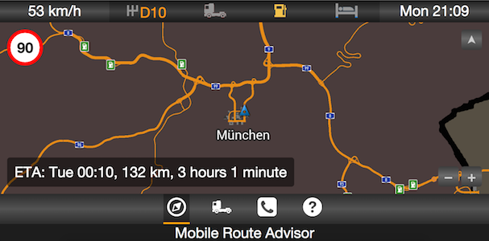
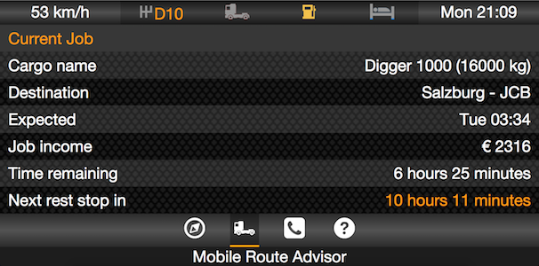
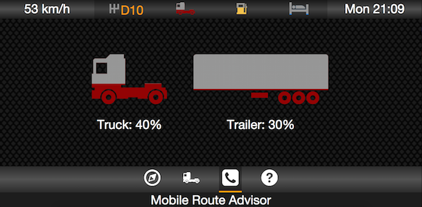

# ETS2 Mobile Route Advisor   
Euro Truck Simulator 2's Route Advisor, for mobile devices. This is a skin for funbit's [ETS2 Telemetry Server](https://github.com/Funbit/ets2-telemetry-server).

## Features
The mobile Route Advisor is planned to include all features that Euro Truck Simulator 2's Route Advisor currently has. These features are:

- Navigation
    - Mini-map
        - Fixed on truck, up is always north
        - Fixed on truck, map rotates so up is direction truck is facing
        - Free view/rotate/zoom
    - Speed limit
    - Distance Remaining
    - Estimated time of arrival (ETA)
    - Time to destination
- Current job information
    - Current load
    - Destination city
    - Payout
    - Time remaining
    - Time until next rest
- Truck damage / load damage
- Localization support
- [Various configuration options](https://github.com/mkoch227/ets2-mobile-route-advisor/wiki/config.json-Parameters)

## Requirements
- Euro Truck Simulator 2
- [ETS2 Telemetry Server](https://github.com/Funbit/ets2-telemetry-server) 3.0.7 or later

## How to Install
1. Download the latest version of the Mobile Route Advisor from either the [official website](http://www.mikekoch.me/ets2-mobile-route-advisor), or from the [releases page](https://www.github.com/mkoch227/ets2-mobile-route-advisor/releases).
2. Extract the contents of the zip to the ETS2 Telemetry Server's `/server/Html/skins` directory. You should then have a folder named `ets2-mobile-route-advisor` in the `skins` directory.

## Support
If you require any type of support, please looking at the [contributing guidelines](https://github.com/mkoch227/ets2-mobile-route-advisor/blob/master/CONTRIBUTING.md) to see where you should post your request. **Please do not contact me directly via e-mail, as your e-mail will be ignored.**

## Languages
A list of supported languages are available on the [repository's wiki](https://github.com/mkoch227/ets2-mobile-route-advisor/wiki/config.json-Parameters). If you would like to submit a translation, please submit a pull request.

## Screenshots

## Contributors
<table>
    <tr>
        <th>Development</th>
        <th>Translations</th>
        <th>Map</th>
    </tr>
    <tr>
        <td valign="top">
            <ul>
                <li><a href="https://github.com/mkoch227">mkoch227</a></li>
                <li><a href="https://github.com/denilsonsa">denilsonsa</a></li>
            </ul>
        </td>
        <td valign="top">
            <ul>
                <li><a href="https://github.com/mkoch227">mkoch227</a></li>
                <li><a href="https://github.com/Phil0499">Phil0499</a></li>
                <li><a href="https://github.com/raflix261">raflix261</a></li>
                <li><a href="https://github.com/pedropandolfi">pedropandolfi</a></li>
                <li><a href="http://forum.scssoft.com/memberlist.php?mode=viewprofile&u=127033">MinecraftMarioGuy53</a></li>
                <li><a href="http://forum.scssoft.com/memberlist.php?mode=viewprofile&u=3710">SchorschiBW</a></li>
                <li><a href="https://github.com/denilsonsa">denilsonsa</a></li>
            </ul>
        </td>
        <td valign="top">
            <ul>
                <li><a href="https://github.com/Funbit">Funbit</a></li>
            </ul>
        </td>
    </tr>
</table>
